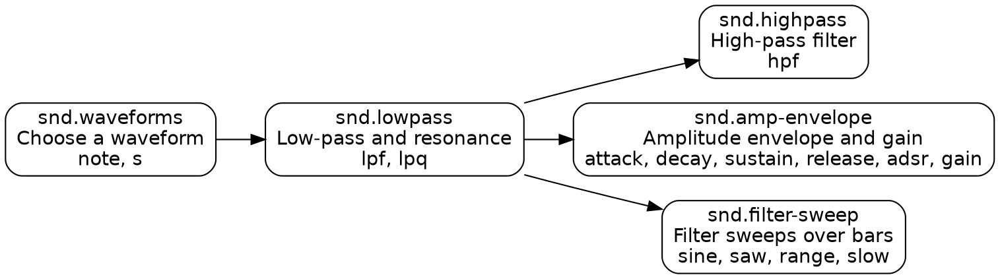

# Curriculum

The curriculum is a **skill graph**: a directed acyclic graph of prerequisites, not a fixed sequence. The Today session offers the next new skill among those whose prerequisites are met (PROPOSAL.md §12). The graph's source of truth is `content/skills.yaml`. This page explains it and must be kept in sync with it.

## Unit goals

| Milestone | Unit | Goal | Status |
|---|---|---|---|
| **M1** | **U3a Sound basics** | Build a synth voice from the source outward: waveform, low-pass and resonance, high-pass, amplitude envelope and gain, filter sweeps over bars. | **Written** (5 skills, 20 variants) |
| M2 | U1 Time & rhythm | Cycles and the time conventions, mini-notation, drums with `s` and `bank`, `stack`, `setcpm`, drum dictation. | Planned |
| M2 | U2 Pitch, voices & harmony basics | `note` and `n` with `scale`, chords in mini-notation, parallel voices from one line, polyphony, first `chord` and `voicing`. | Planned |
| M2 | U3b Sound, continued | Filter envelopes, more resonance, FM, noise, effects such as `room` and `delay`. Uses the full timbre lexicon. | Planned |
| M2 | U4 Time & modulation | Continuous signals, `range`, `slow`, `segment`, and sweeps tied to bars and verses. | Planned |
| M3 | U5–U12 | Advanced harmony and voicing, pattern transforms, layering and buses, detune, the three genre tracks, form and arc. | Planned |

U3a comes before U1 and U2 in M1 because it is the vertical slice (R-STACK). The first U3a lesson (waveforms) therefore teaches the small amount of mini-notation the unit needs (`[ ]`, `*n`, `@n`, `!n`, `,`, `<...>`) in one paragraph, and U1 teaches it properly later.

## U3a: Sound basics

**Learner outcome.** Given a timbre heard in the head, or a word such as "warm", "hollow" or "plucky", the learner can choose a waveform, set the filters and envelope, and make the sound change over bars, typing idiomatic Strudel without looking anything up.

**Classical bridges used** (R-PEDAGOGY): organ registration and orchestral colour for waveforms, the swell box and sung vowels for low-pass and resonance, orchestration of the bass register for high-pass, articulation (piano decay, organ gate, *messa di voce*) for envelopes, and terraced dynamics versus hairpins for stepped versus continuous sweeps.

| Skill | Prereqs | Lesson | Variants (type) |
|---|---|---|---|
| `snd.waveforms` | none | Four waveforms, four registrations | v01 spec-to-code, v02 dictation, v03 match-by-ear, v04 describe-to-code |
| `snd.lowpass` | waveforms | Low-pass filter and resonance | v01 spec-to-code, v02 describe-to-code, v03 match-by-ear |
| `snd.highpass` | lowpass | High-pass filter and the signal chain | v01 spec-to-code, v02 describe-to-code, v03 sweep, v04 match-by-ear |
| `snd.amp-envelope` | lowpass | Articulation with an amplitude envelope | v01 spec-to-code, v02 recall, v03 describe-to-code, v04 match-by-ear, v05 dictation |
| `snd.filter-sweep` | lowpass | Filter sweeps over bars | v01 sweep, v02 sweep, v03 sweep, v04 match-by-ear |

`snd.amp-envelope` requires `snd.lowpass` because its lesson and its pad variant shape a filtered sawtooth, and pads need the filter (ADR 0200, amendments).

Several variants also list a second skill they exercise, such as `snd.highpass.v03`, which is also a sweep. A variant id is always named after its *first* skill.

Exercise-type coverage in U3a: 4 spec-to-code, 4 describe-to-code, 5 match-by-ear, 4 sweep, 2 dictation, 1 recall. This meets the M1 rule of at least one each of dictation, describe-to-code, match-by-ear and sweep.

**Deliberately left for later units:** filter envelopes (`lpenv` and friends) and `ftype` go to U3b; `segment` and `perlin` go to U4; samples and drum banks go to U1. U3a uses synth sounds only, so it works offline.
