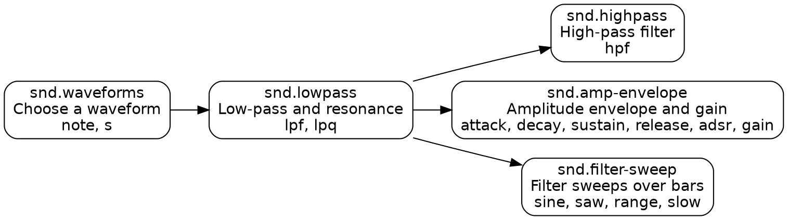
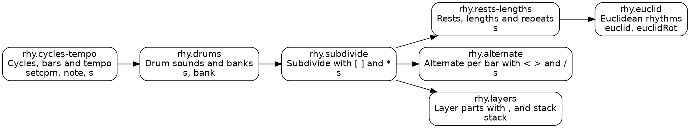
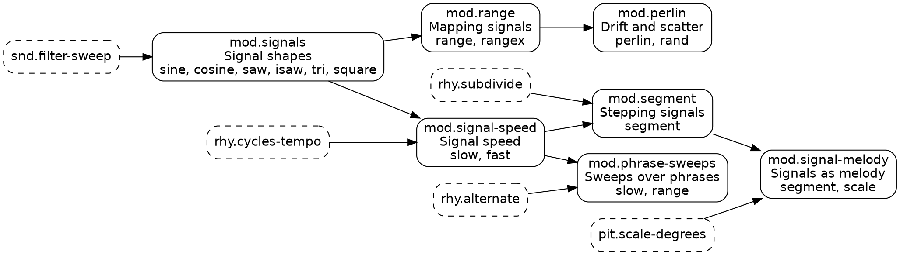

# Curriculum

The curriculum is a **skill graph**: a directed acyclic graph of prerequisites, not a fixed sequence. The Today session offers the next new skill among those whose prerequisites are met (PROPOSAL.md §12). The graph's source of truth is `content/skills.yaml`. This page explains it and must be kept in sync with it.

## Unit goals

| Milestone | Unit | Goal | Status |
|---|---|---|---|
| **M1** | **U3a Sound basics** | Build a synth voice from the source outward: waveform, low-pass and resonance, high-pass, amplitude envelope and gain, filter sweeps over bars. | **Written** (5 skills, 20 variants) |
| M2 | U1 Time & rhythm | Cycles and the time conventions, mini-notation, drums with `s` and `bank`, `stack`, `setcpm`, drum dictation. | **Written** (7 skills, 27 variants) |
| M2 | U2 Pitch, voices & harmony basics | `note` and `n` with `scale`, chords in mini-notation, parallel voices from one line, polyphony, first `chord` and `voicing`. | In progress |
| M2 | U3b Sound, continued | Filter envelopes, more resonance, FM, noise, effects such as `room` and `delay`. Uses the full timbre lexicon. | In progress |
| M2 | U4 Time & modulation | Continuous signals, `range`, `slow`, `segment`, and sweeps tied to bars and verses. | Written (7 skills, 27 variants) |
| M3 | U5–U12 | Advanced harmony and voicing, pattern transforms, layering and buses, detune, the three genre tracks, form and arc. | Planned |

U3a comes before U1 and U2 in M1 because it is the vertical slice (R-STACK). The first U3a lesson (waveforms) therefore teaches the small amount of mini-notation the unit needs (`[ ]`, `*n`, `@n`, `!n`, `,`, `<...>`) in one paragraph, and U1 teaches it properly later.

## U3a: Sound basics

**Learner outcome.** Given a timbre heard in the head, or a word such as "warm", "hollow" or "plucky", the learner can choose a waveform, set the filters and envelope, and make the sound change over bars, typing idiomatic Strudel without looking anything up.

**Classical bridges used** (R-PEDAGOGY): organ registration and orchestral colour for waveforms, the swell box and sung vowels for low-pass and resonance, orchestration of the bass register for high-pass, articulation (piano decay, organ gate, *messa di voce*) for envelopes, and terraced dynamics versus hairpins for stepped versus continuous sweeps.

| Skill | Prereqs | Lesson | Variants (type) |
|---|---|---|---|
| `snd.waveforms` | none | Four waveforms, four registrations | v01 spec-to-code, v02 dictation, v03 match-by-ear, v04 describe-to-code |
| `snd.lowpass` | waveforms | Low-pass filter and resonance | v01 spec-to-code, v02 describe-to-code, v03 match-by-ear |
| `snd.highpass` | lowpass | High-pass filter and the signal chain | v01 spec-to-code, v02 describe-to-code, v03 sweep, v04 match-by-ear |
| `snd.amp-envelope` | lowpass | Articulation with an amplitude envelope | v01 spec-to-code, v02 recall, v03 describe-to-code, v04 match-by-ear, v05 dictation |
| `snd.filter-sweep` | lowpass | Filter sweeps over bars | v01 sweep, v02 sweep, v03 sweep, v04 match-by-ear |

`snd.amp-envelope` requires `snd.lowpass` because its lesson and its pad variant shape a filtered sawtooth, and pads need the filter (ADR 0200, amendments).

Several variants also list a second skill they exercise, such as `snd.highpass.v03`, which is also a sweep. A variant id is always named after its *first* skill.

Exercise-type coverage in U3a: 4 spec-to-code, 4 describe-to-code, 5 match-by-ear, 4 sweep, 2 dictation, 1 recall. This meets the M1 rule of at least one each of dictation, describe-to-code, match-by-ear and sweep.

**Deliberately left for later units:** filter envelopes (`lpenv` and friends) and `ftype` go to U3b; `segment` and `perlin` go to U4; samples and drum banks go to U1. U3a uses synth sounds only, so it works offline.

## U1: Time & rhythm

**Learner outcome.** Given a rhythm on a staff (pitched or percussion), heard by ear, or described in musical terms ("a backbeat at 100 BPM", "triple-tongued triplets on beats 1 and 2", "the tresillo starting on its second hit"), the learner can write it in mini-notation without looking anything up: the tempo with `setcpm(BPM / 4)`, steps that share the bar, `[ ]` and `*` for subdivisions and tuplets, `~`, `@` and `!` for rests, lengths and repeats, `< >` and `/` for bar-to-bar changes, the comma and `stack` for layers and polyrhythms, and `(k,n,r)` for Euclidean rhythms. They know the two facts that keep rhythms honest: the bar (cycle) never stretches, and a drum sample rings to its end whatever its step length.

**Classical bridges used** (R-PEDAGOGY): the conductor's beat pattern and the metronome mark for cycles and tempo, percussion-part notation (note value = time to the next stroke) for drums, tuplet brackets and triple tonguing for subdivision, the fermata (which Strudel cannot express) for `@`, first and second endings for `< >`, the hemiola ratio and one barline across all staves for layers, and 3 + 3 + 2 groupings for the tresillo.

| Skill | Prereqs | Lesson | Variants (type) |
|---|---|---|---|
| `rhy.cycles-tempo` | none | One bar, one cycle | v01 spec-to-code, v02 transform, v03 match-by-ear, v04 dictation |
| `rhy.drums` | cycles-tempo | Drum names and drum machines | v01 dictation (drums), v02 describe-to-code, v03 match-by-ear |
| `rhy.subdivide` | drums | Divide a step: [ ] and * | v01 dictation (drums), v02 spec-to-code, v03 ear-dictation, v04 read-the-code |
| `rhy.rests-lengths` | subdivide | Rests, lengths and repeats | v01 dictation, v02 ear-dictation, v03 spec-to-code, v04 refactor |
| `rhy.alternate` | subdivide | One per bar: < > and / | v01 dictation (drums), v02 sweep, v03 describe-to-code, v04 spec-to-code |
| `rhy.layers` | subdivide | Layers: the comma and stack | v01 dictation (drums, two voices), v02 spec-to-code, v03 transform, v04 read-the-code |
| `rhy.euclid` | rests-lengths | Euclidean rhythms | v01 dictation (drums), v02 spec-to-code, v03 refactor, v04 ear-dictation |

The DAG follows what each skill's notation needs. `rhy.drums` comes right after the time conventions so that every later skill can use drums. Subdivision is the base for the three branches (rests and lengths, alternation, layers). `rhy.euclid` requires `rhy.rests-lengths` because a Euclidean rhythm is a pattern of hits and rests, and its lesson and refactor variant compare `(3,8)` with the same rhythm written out with `~`. U1 variants use only the notation of their skill and its ancestors, so `rhy.euclid` uses no `< >` and `rhy.layers` uses no `~`.

Exercise-type coverage in U1: 7 dictation (5 of them drum dictations with `clef=perc` and `compare: [onset, duration]`; `rhy.layers.v01` checks one voice of a stacked kit with `only_sounds`), 6 spec-to-code, 3 ear-dictation, 2 describe-to-code, 2 match-by-ear, 2 transform, 2 read-the-code, 2 refactor, 1 sweep.

**Network.** Drum content uses `s` with `bank` (TR-808 and TR-909) and needs the network (ADR 0201 §1). Wherever a synth makes the rhythmic point just as well, U1 uses a synth: 18 of the 27 variants and most lesson examples work offline.

**Verified behaviour the unit relies on** (pinned source, checked in the harness): the default tempo is 0.5 cycles per second (`packages/core/cyclist.mjs#L24`) and `setcpm` divides by 60 (`packages/core/repl.mjs#L132-L135`); `@` adds weight and `!` adds full steps (`packages/mini/krill.pegjs#L134-L145`); `~` and `-` are rests (`packages/mini/mini.mjs#L157-L158`); a sample plays to its natural end unless `clip`, `loop` or `release` is set (`packages/superdough/sampler.mjs#L313-L317`); Euclidean rotation `r` moves every hit `r` slots *later* (`packages/core/euclid.mjs#L130-L136`, `packages/core/util.mjs#L153`; the harness shows `(3,8,1)` on slots 2, 5 and 8).

**Deliberately left for later units:** `_` (another way to lengthen a step), `?` and `|` (randomness), `{ }` polymeters, `n` for choosing among a bank's samples, `ply`, `struct` and `clip` go to the pattern-transform units in M3.

## U4: Time & modulation

**Learner outcome.** Given a change over time described in musical terms ("darker through every bar", "one arc per eight-bar verse", "a wobble on every beat", "drifting, never settling", "an arch in thirds"), the learner can choose the signal shape, map it with `range` or `rangex`, set its speed with `slow` or `fast`, step it with `segment`, and type it without looking anything up. They also know the two traps that make a signal inaudible or misaligned: too few notes to carry a fast signal, and `slow` or `segment` in the wrong place in the chain.

**Classical bridges used** (R-PEDAGOGY): dynamic shapes (*messa di voce*, *subito piano*, Baroque echo) for the six signals, trombone slide positions for `rangex`, the piano hammer for sampling at each onset, trombone versus piano glissando for `segment`, choral tone and piano touch for `perlin` and `rand`, a chant's melodic arch for signals as melody, and verse-by-verse dynamic planning for phrase sweeps.

U4 builds on `snd.filter-sweep` (ADR 0201 §5), which already taught `sine.range(a, b).slow(n)` and `saw`. No U4 lesson re-teaches that chain.

Dashed nodes are prerequisites from other units.

| Skill | Prereqs | Lesson | Variants (type) |
|---|---|---|---|
| `mod.signals` | snd.filter-sweep | Six signal shapes | v01 sweep, v02 match-by-ear, v03 read-the-code, v04 describe-to-code |
| `mod.range` | signals | Even steps or even ratios: range and rangex | v01 transform, v02 sweep, v03 describe-to-code, v04 match-by-ear |
| `mod.signal-speed` | signals, rhy.cycles-tempo | Signal speed: slow, fast, and the notes that carry them | v01 sweep, v02 transform, v03 match-by-ear, v04 spec-to-code |
| `mod.segment` | signal-speed, rhy.subdivide | Stepping a signal with segment | v01 dictation, v02 spec-to-code, v03 sweep, v04 match-by-ear |
| `mod.perlin` | range | Drift with perlin, scatter with rand | v01 describe-to-code, v02 spec-to-code, v03 match-by-ear, v04 transform |
| `mod.signal-melody` | segment, pit.scale-degrees | Signals as melody | v01 dictation, v02 match-by-ear, v03 spec-to-code |
| `mod.phrase-sweeps` | signal-speed, rhy.alternate | Sweeps that follow the form | v01 sweep, v02 sweep, v03 match-by-ear, v04 describe-to-code |

Exercise-type coverage in U4: 6 sweep, 7 match-by-ear, 4 describe-to-code, 4 spec-to-code, 3 transform, 2 dictation, 1 read-the-code. Phrase-long sweeps use `verify.cycles` that cover two full periods (8 for a four-bar sweep, 16 for an eight-bar verse, 32 for a sixteen-bar two-verse form), so the reset is in the snapshot.

**Verified behaviour the unit relies on** (pinned source, checked in the harness): the phase of each signal on the downbeat (`packages/core/signal.mjs`); `rangex` maps through logarithms (`packages/core/pattern.mjs#L1786-L1788`); `segment` takes the value at the start of each step; `scale` rounds a fractional degree up (`packages/tonal/tonal.mjs#L36-L37`); `perlin` interpolates between random values at whole cycles, and `perlin` and `rand` are pure functions of time that are both 0 at cycle 0 and repeat after 300 cycles (legacy RNG, the default at the pin).

**Deliberately left for later units:** bipolar signals (`sine2` and friends), `itri`, `berlin`, `irand`, `seed`, `round` and signal arithmetic go to the pattern-transform units in M3.
